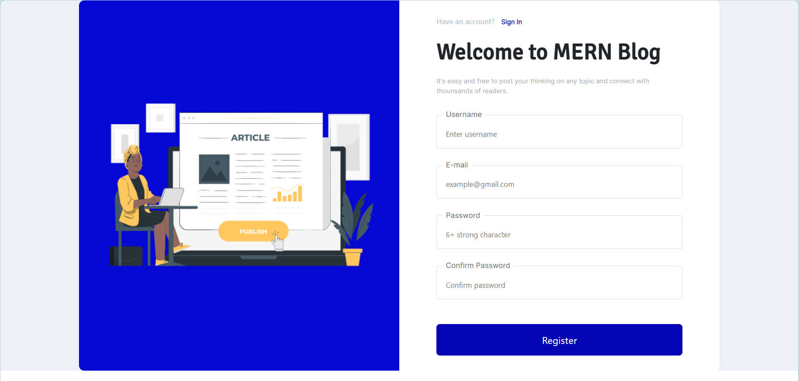
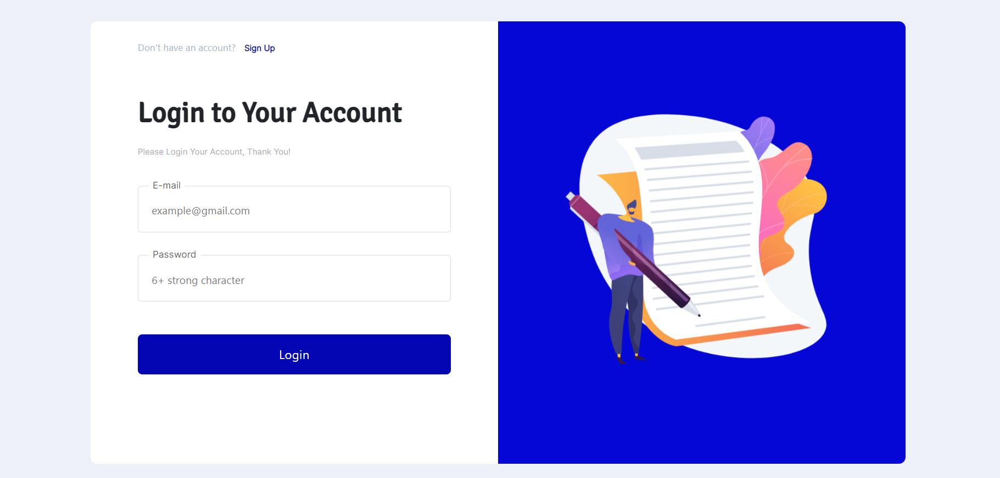
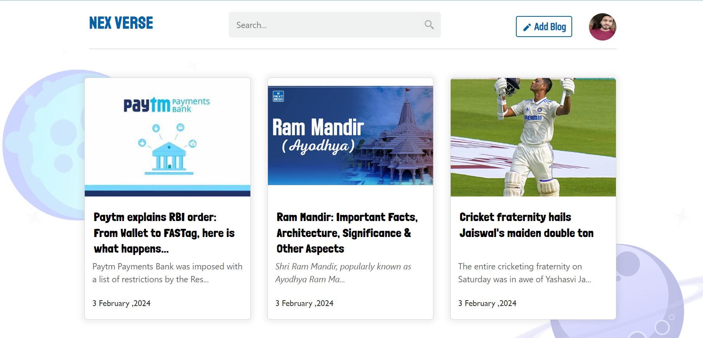
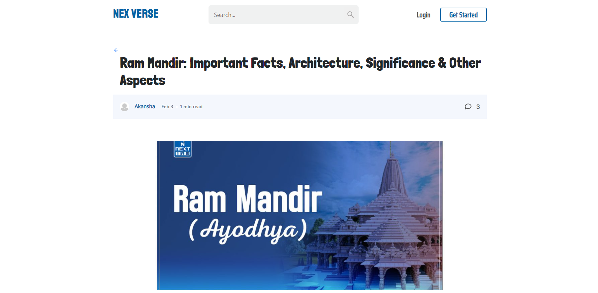
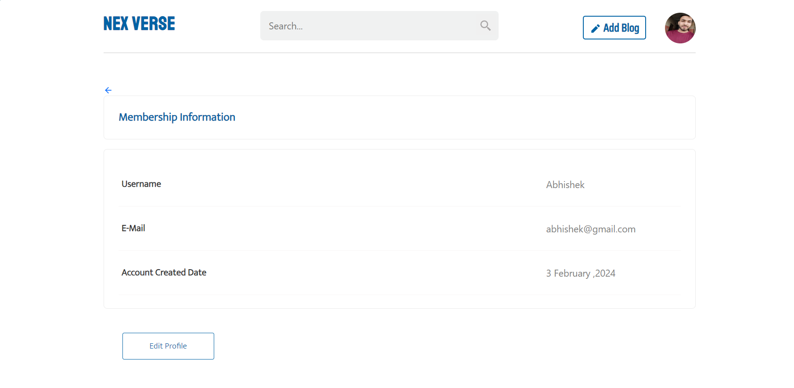
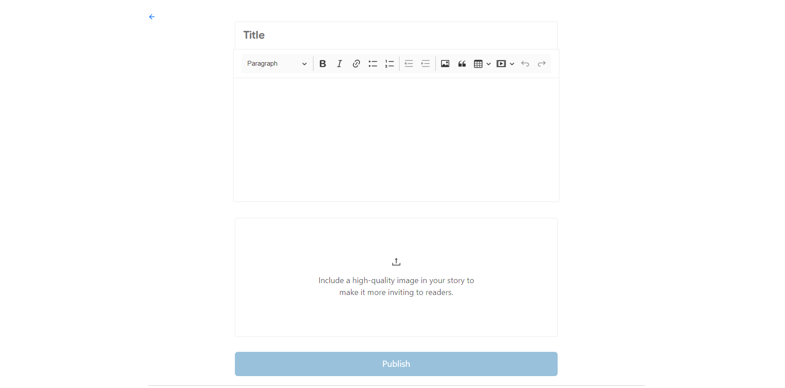

# NexVerse Blog Website Project using MERN Stack

This project is a full-stack blog website developed using the MERN stack. It allows users to read, create, edit, and delete blog posts. The website has a modern and responsive user interface built using React.js on the front end, a RESTful API implemented with Express.js on the back end, and MongoDB as the database to store blog posts and user information.

## Tech Stack

- **Frontend**:
  - React.js: A JavaScript library for building user interfaces.
  - React Router: For handling routing within the React application.
  - Redux: For managing application state and data flow.
  - Axios: For making HTTP requests to the backend API.

- **Backend**:
  - Node.js: A JavaScript runtime for building server-side applications.
  - Express.js: A web application framework for Node.js, used for building the RESTful API.
  - MongoDB: A NoSQL database used for storing blog posts, user information, and other data.
  - Mongoose: An ODM (Object Data Modeling) library for MongoDB, used for interacting with the database.
  - JWT: JSON Web Tokens for implementing authentication.

## Features
- **User Authentication**: Allow users to register, login, and manage their profiles.
- **Create, Read, Update, Delete (CRUD) Operations**: Enable users to create, read, update, and delete blog posts.
- **Comments and Reactions**: Allow users to comment on blog posts and react to them (like, dislike, etc.).
- **Search Functionality**: Provide users with a search feature to find specific blog posts based on keywords, tags, or categories.
- **Responsive Design**: Ensure the website is responsive and works well on various devices and screen sizes.
- **Rich Text Editor**: Integrate a rich text editor for creating and formatting blog posts.
- **Pagination**: Implement pagination to manage large numbers of blog posts efficiently.
- **User Profiles**: Each user has their own profile page where they can view their own blog posts and edit their profile information.
- **Image Upload**: Allow users to upload images to accompany their blog posts.

## Screenshots

### Registration Page


### Login Page


### Homepage


### Full Blog


### Profile


### Publish Blog



## Getting Started

To run this application locally, follow these steps:

1. Clone the repository:
   
    git clone https://github.com/abhisunny2610/MERN-Projects/Blog%Website.git

2. Navigate to the project directory: 
   
    cd Blog Website

3. Install dependencies for both the client and server:

    cd frontend \
    npm install \
    cd ../backend \
    npm install

4. Set up environment variables:

   - Create a `.env` file in the `server` directory.
   - Add the following variables:
     ```
     MONGODB_URI=<your-mongodb-uri>
     JWT_SECRET=<your-jwt-secret>
     ```

5. Start the backend:
   
    cd backend \
    npm start


6. Start the frontend:

    cd ../frontend \
    npm start

7. Open your web browser and navigate to `http://localhost:3000` to view the application.


